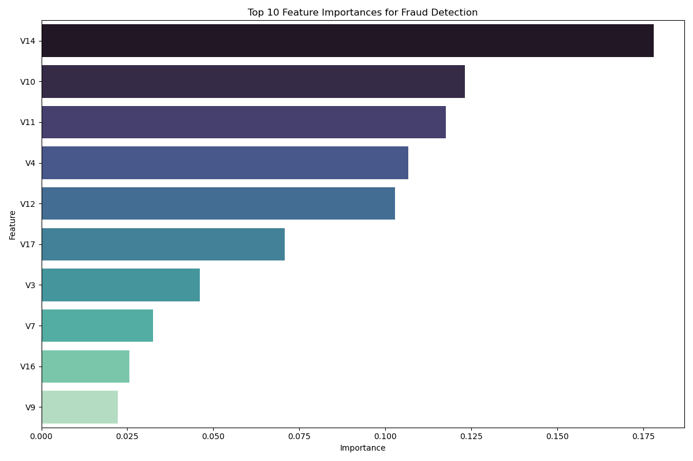

# 💳 Credit Card Fraud Detection


## 🎯 Project Overview

This project develops a machine learning model to detect fraudulent credit card transactions. Due to the highly imbalanced nature of fraud data (fraud cases represent only ~0.17% of transactions), we implement specialized techniques to build an effective detection system.

## 🚨 Problem Statement

Credit card fraud costs billions annually and affects both financial institutions and customers. Traditional rule-based systems are insufficient to detect sophisticated fraud patterns. This project aims to:

- ✅ Identify fraudulent transactions with high accuracy
- ❌ Minimize false positives (legitimate transactions incorrectly flagged)
- 🔍 Provide interpretable insights into fraud patterns

## 📊 Dataset

| Attribute | Details |
|-----------|---------|
| **Source** | Credit card transactions dataset containing transactions made by European cardholders |
| **Features** | 28 PCA-transformed features (V1-V28), Time, Amount, and Class |
| **Target** | Class (0: Non-Fraud, 1: Fraud) |
| **Size** | 284,807 transactions |
| **Imbalance** | Fraud transactions represent only 0.17% of all transactions |

## 🔬 Approach & Methodology

### 1. 📈 Exploratory Data Analysis (EDA)
- Analyzed class distribution to understand imbalance
- Examined transaction amount patterns for fraud vs non-fraud
- Investigated temporal patterns in fraud occurrences
- Identified feature correlations with fraud

### 2. 🔧 Data Preprocessing
- Created balanced subset (all fraud cases + 5,000 non-fraud cases)
- Removed duplicate transactions
- Split data with stratification (80% training, 20% testing)
- Standardized 'Time' and 'Amount' features

### 3. ⚖️ Handling Class Imbalance
- Applied **SMOTE** (Synthetic Minority Over-sampling Technique)
- Generated synthetic fraud samples to balance training data
- Resulted in perfectly balanced training set (50% fraud, 50% non-fraud)

### 4. 🤖 Model Training & Evaluation
**Tested multiple algorithms:**
- HistGradientBoosting
- RandomForest
- LogisticRegression

**Evaluation Process:**
- Used cross-validation and hyperparameter tuning with GridSearchCV
- Evaluated models using multiple metrics:
  - Precision, Recall, F1-Score
  - ROC-AUC, Balanced Accuracy
  - Matthews Correlation Coefficient, Cohen's Kappa

### 5. 🏆 Model Selection
- Selected **RandomForest** based on best F1-score (0.9368)
- Analyzed feature importance for interpretability
- Generated visualizations for model performance

## 📊 Key Results

### 🎯 Model Performance (RandomForest)

| Metric | Score | Description |
|--------|-------|-------------|
| **F1-Score** | 0.9368 | Excellent balance between precision and recall |
| **Precision** | 0.9368 | 94% of fraud predictions are correct |
| **Recall** | 0.9368 | Catches 94% of actual frauds |
| **ROC-AUC** | 0.9879 | Near-perfect discrimination ability |
| **Balanced Accuracy** | 0.9654 | High performance on both classes |
| **Matthews Correlation Coefficient** | 0.9308 | Strong correlation between predictions and actuals |
| **Cohen's Kappa** | 0.9308 | Excellent agreement beyond chance |

### 📋 Confusion Matrix Results

| | Predicted Non-Fraud | Predicted Fraud |
|---|---|---|
| **Actual Non-Fraud** | 994 (True Negatives) | 6 (False Positives) |
| **Actual Fraud** | 6 (False Negatives) | 89 (True Positives) |

### 🔍 Feature Importance

Top predictive features that drive fraud detection:

| Feature | Importance | Description |
|---------|------------|-------------|
| **V14** | 17.8% | Strongest fraud indicator |
| **V10** | 12.3% | Second most important feature |
| **V11** | 11.8% | Third highest predictive power |
| **V4** | 10.7% | Significant fraud predictor |
| **V12** | 10.3% | Important discriminative feature |

## 📈 Visualizations

### Confusion Matrix


### ROC Curve and Precision-Recall Curve


### Feature Importance


### Cumulative Feature Importance


## 🛠️ Technologies & Libraries Used

| Category | Technologies |
|----------|-------------|
| **Programming Language** | Python 3.8+ |
| **Data Manipulation** | Pandas, NumPy |
| **Machine Learning** | Scikit-learn, Imbalanced-learn |
| **Visualization** | Matplotlib, Seaborn |
| **Model Persistence** | Joblib |

## 📁 Project Structure

```
credit-card-fraud-detection/
├── notebooks/
│   └── credit_card_fraud_detection.ipynb
├── models/
│   ├── fraud_detection_model.pkl
│   └── scaler.pkl
├── visualizations/
│   ├── confusion_matrix.png
│   ├── roc_curve + precision-recall_curve.png
│   ├── feature_importance.png
│   └── cumulative_feature_importance.png
├── README.md
└── requirements.txt
```

## 🚀 How to Run the Project

### 1. Clone the repository
```bash
git clone https://github.com/adeel-iqbal/credit-card-fraud-detection.git
cd credit-card-fraud-detection
```

### 2. Install required packages
```bash
pip install -r requirements.txt
```

### 3. Run the Jupyter notebook
```bash
jupyter notebook notebooks/credit_card_fraud_detection.ipynb
```

### 4. Execute Analysis
Follow the notebook cells to reproduce the analysis and results.

## 🔮 Future Improvements

- 🎯 **Threshold Optimization**: Adjust classification threshold based on business costs
- ⚡ **Real-time Implementation**: Deploy model for transaction scoring
- 🔧 **Feature Engineering**: Create domain-specific features
- 📊 **Model Monitoring**: Track performance drift over time
- 🧠 **Advanced Techniques**: Experiment with deep learning approaches

## 📧 Contact

- **Email:** [adeelmemon096@yahoo.com](mailto:adeelmemon096@yahoo.com)  
- **LinkedIn:** [Adeel Iqbal](https://www.linkedin.com/in/adeeliqbalmemon)

---

⭐ **If you found this project helpful, please give it a star!** ⭐
